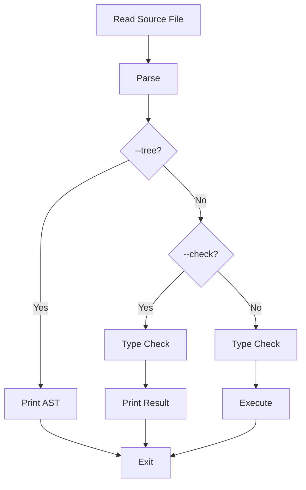

## Overview

The Ivy compiler supports several command-line flags to control compilation and execution behavior. All flags can be combined when running Ivy programs.

## Available Flags

### Help Flag

<ParamField path="-h, --help" type="flag">
  Display usage information and available options
  
  **Usage:**
  ```bash
  ivy --help
  ```
  
  **Output:**
  ```
  Usage:
    ivy <file>      Run an Ivy program
    ivy             Start the Ivy REPL

  Options:
    -c, --check     Type check without running
    -t, --tree      Print the syntax tree
    -h, --help      Print this help message
  ```
</ParamField>

### Syntax Tree Flag

<ParamField path="-t, --tree" type="flag">
  Print the abstract syntax tree (AST) of the program without executing it
  
  **Usage:**
  ```bash
  ivy --tree examples/hello.ivy
  ```
  
  **Example Output:**
  ```rust
  Program {
      declarations: [
          Decl::Let {
              pattern: Pattern::Var("greeting"),
              value: Expr::String("Hello, World!"),
              public: false,
          },
          Decl::Let {
              pattern: Pattern::Var("main"),
              value: Expr::Call {
                  func: Expr::Var("print"),
                  arg: Expr::Var("greeting"),
              },
              public: false,
          },
      ],
  }
  ```
  
  <Note>
  The `--tree` flag is useful for debugging parser issues or understanding how Ivy parses your code.
  </Note>
</ParamField>

### Type Check Flag

<ParamField path="-c, --check" type="flag">
  Perform type checking without executing the program. Exits with status 0 if type checking succeeds, 1 if it fails.
  
  **Usage:**
  ```bash
  ivy --check examples/fibonacci.ivy
  ```
  
  **Success Output:**
  ```
  OK: examples/fibonacci.ivy type checks successfully
  ```
  
  **Error Output:**
  ```
  Error: type mismatch
    ┌─ examples/fibonacci.ivy:12:20
    │
  12 │     fibonacci(n - "1") + fibonacci(n - 2)
    │                   ^^^ expected Int, found String
  ```
  
  <Note>
  This flag is particularly useful in CI/CD pipelines to validate code without executing it.
  </Note>
</ParamField>

## Combining Flags

Flags can be combined in any order. The last specified mode flag takes precedence.

### Check and Tree

```bash
ivy --check --tree examples/program.ivy
```

<Note>
When both `--check` and `--tree` are specified, only `--check` is performed since it's processed later in the flag parsing logic.
</Note>

## Flag Parsing Behavior

The Ivy CLI parses flags in the order they appear on the command line:

<CodeGroup>
```bash Valid Invocations
# Type check a file
ivy -c main.ivy
ivy --check main.ivy

# Show syntax tree
ivy -t main.ivy
ivy --tree main.ivy

# Multiple flags
ivy -c -t main.ivy
ivy --check --tree main.ivy

# Mixed short and long forms
ivy -c --tree main.ivy
```

```bash Invalid Invocations
# Unknown flag
ivy --verbose main.ivy
# Output: Unknown option: --verbose

# Flag after REPL mode (ignored)
ivy --check
# Starts REPL instead of checking
```
</CodeGroup>

## Implementation Details

The flag parsing is implemented in `main.rs:669-699`. The implementation:

1. Iterates through command-line arguments
2. Sets boolean flags for `--tree` and `--check`
3. Treats the first non-flag argument as the file path
4. If no file is specified, launches the REPL
5. If a file is specified, runs it with the appropriate flags

### Source Code Reference

```rust
fn main() {
    let args: Vec<String> = env::args().collect();

    let mut show_tree = false;
    let mut type_check = false;
    let mut file_path: Option<&str> = None;

    let mut i = 1;
    while i < args.len() {
        match args[i].as_str() {
            "-h" | "--help" => {
                print_usage();
                return;
            }
            "-t" | "--tree" => {
                show_tree = true;
            }
            "-c" | "--check" => {
                type_check = true;
            }
            arg if !arg.starts_with('-') => {
                file_path = Some(arg);
            }
            arg => {
                eprintln!("Unknown option: {}", arg);
                print_usage();
                std::process::exit(1);
            }
        }
        i += 1;
    }

    match file_path {
        Some(path) => run_file(path, show_tree, type_check),
        None => repl(),
    }
}
```

See `main.rs:669-705` for the full implementation.

## Execution Pipeline

When flags are combined with file execution, the pipeline follows this order:

1. **Parse** - Read and parse the source file
2. **Type Check** - Perform type inference and checking
3. **Execute or Display**:
   - If `--check`: Display type check result and exit
   - If `--tree`: Display AST and exit  
   - Otherwise: Run the interpreter



## Error Handling

All flags respect Ivy's comprehensive error reporting:

- **Parse errors** - Shown with source context and line numbers
- **Type errors** - Displayed with expected vs. found types
- **Unknown flags** - Trigger usage message and exit with status 1
- **File not found** - Report I/O error and exit with status 1